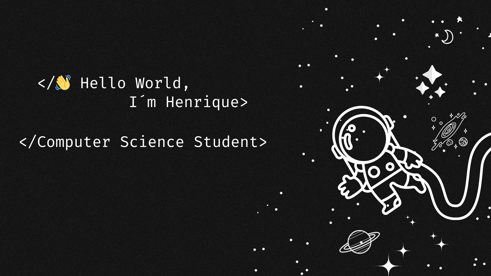

## Um Pouco Sobre Mim

Olá! Meu nome é **Henrique Galvão**, sou estudante de **Ciência da Computação** na Universidade Paulista (UNIP) e entusiasta de tecnologia e desenvolvimento de software. Ao longo da minha trajetória, desenvolvi habilidades essenciais como **disciplina**, **organização**, **persistência** e **foco no cumprimento de metas**.

Adquiri essas experiências profissionais durante o período em que **servi o Exército entre 2023 e 2024**, atuando na **segurança e manutenção da ordem da Vila Militar**. Essa vivência fortaleceu minha capacidade de seguir **métodos e protocolos**, com atenção aos detalhes e foco em **resultados concretos**, além de aprimorar meu **senso de responsabilidade** e **trabalho em equipe**.

Atualmente, estou em constante aprendizado, explorando áreas como:

- Desenvolvimento de Sotware
- Lógica de programação
- Segurança da informação
- Inteligência artificial
- Ciência de dados

🎯 **Busco estágio na área de Tecnologia da Informação, com foco em desenvolvimento de software, análise de dados e segurança da informação.**
 

  
  
  
  

## Minhas Estatísticas

  
  

 

## 🚀 Metas para 2025
- Aumentar contribuições em cursos complementares e atividades extracurriculares.
- Desenvolver mais projetos pessoais e academicos 
- Melhorar minhas estatísticas no GitHub
- Aprender mais sobre Java, Python, Banco de Dados, segurança da informação e novas tecnologias.

## 🛠 Linguagens e Tecnologias  

### Front-end:  

  
  
  

 

### Back-end:  

  
  

 

 

### Ferramentas:  

  
  

